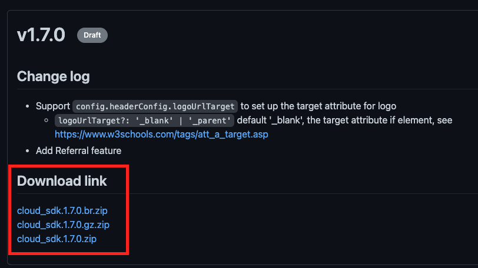
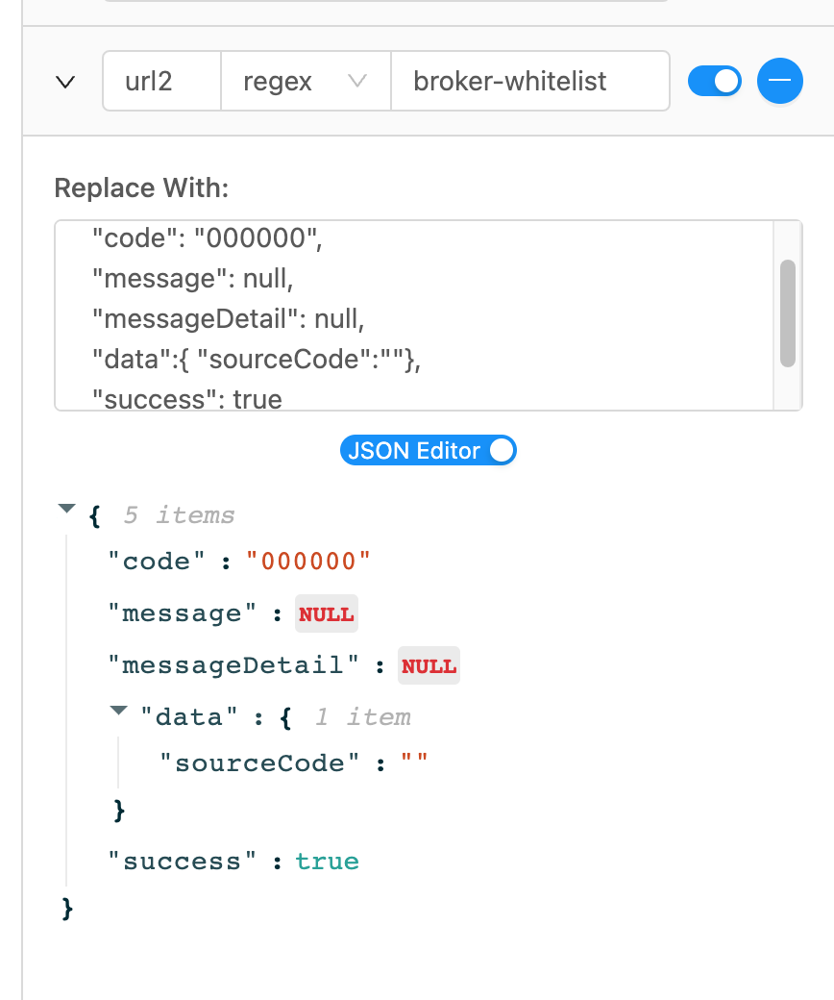
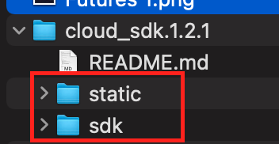

# Asterdex Broker Web SDK

- [AWS onboarding process](#aws-onboarding-process)
- [Download the latest SDK](#download-the-latest-sdk-v174)
- [Configs](#configs)
- [Events](#events)
- [Proxy setup](#proxy-setuponly-if-you-change-the-api-domain-in-sdk)
- [FAQ](#faq)

# Why Integrate with Aster Perps

**Better commercial deal**
- Industry-leading revenue share
- Full control over added spread & fees
- We can support your referral system upon request

**Best experience for users**
- Lowest trading fees
- Tight ticks and deep liquidity across all pairs
- Multi-chain native support — BSC, ETH, SOL, and ARB networks
- Cross-collateral support — more flexibility for your users
- Access to stocks and other asset classes (fully crypto-settled)

**Built for flexibility**
- Request custom trading pairs
- Support for both pro and simple UI modes
- Fast integration with our proven broker SDK

**Trusted model**
- Broker models already live with partners
- Optional co-marketing and trading campaigns
- Hands-on support from the Aster team at every step

Interested? [https://docs.google.com/forms/d/e/1FAIpQLSeUIisZO5wVYC1rLDT5wf0aKT3RTQt_G4KuPH22amjjA7AFpg/viewform?usp=sharing&ouid=115093722732998827513](Get in touch).

## AWS onboarding process

We’ll use AWS as an example to demonstrate the onboarding process. You can, of course, use other cloud platforms as well.

Before starting, make sure you have AWS CLI installed: [https://docs.aws.amazon.com/cli/latest/userguide/getting-started-install.html](https://docs.aws.amazon.com/cli/latest/userguide/getting-started-install.html)

### Step 1: Upload SDK

Download the latest version of SDK zip file from [Releases](https://github.com/asterdex/aster-broker-pro-sdk/releases).



Unzip the file and upload the two folders (static and sdk) to your AWS S3 bucket.

```sh
wget <zip-url> # download zip file from github
unzip <fileanme.zip> # unzip the zip file


aws s3 mb s3://asterdex-s3-test # create s3 bucket: asterdex-s3-test

# upload sdk folder to s3, and grant to all user
aws s3 sync ./sdk s3://asterdex-s3-test/sdk --grants read=uri=http://acs.amazonaws.com/groups/global/AllUsers

# upload static folder to s3, and grant to all user
aws s3 sync ./static s3://asterdex-s3-test/static --grants read=uri=http://acs.amazonaws.com/groups/global/AllUsers

```

### Step 2: Initialize SDK

```sh
# initialize npm and packages
npm init
npm install local-web-server
```

Create a file named `lws.config.js` and paste the following content into it:

```js
module.exports = {
  rewrite: [
    {
      from: "/bapi/(.*)",
      to: "https://www.asterdex.com/bapi/$1",
    },
    {
      from: "/fapi/(.*)",
      to: "https://www.asterdex.com/fapi/$1",
    },
    {
      from: "/cloud-futures/(.*)",
      to: "https://static.asterdex.com/cloud-futures/$1",
    },
    {
      from: "/api/(.*)",
      to: "https://static.asterdex.com/api/$1",
    },
  ],
  directory: "./",
  logFormat: "stats",
};
```

Create an index.html file (you can skip this step if you already have one).
Import the static files you just uploaded and initialize the trading page.

```html
<!DOCTYPE html>
<html>
  <head>
    <meta charset="utf-8" />
    <meta name="viewport" content="width=device-width" />
    <title>My Futures Exchange</title>
    <link rel="icon" type="image/x-icon" href="favicon.ico" />
    <style>
      html,
      body {
        margin: 0;
        padding: 0;
        width: 100vw;
        height: 100vh;
      }

      #app {
        width: 100%;
        height: 100%;
        overflow: hidden;
      }
    </style>
    <script src="/sdk/sdk.1.7.4.js"></script>
  </head>
  <body>
    <div id="app"></div>
    <script>
      const { origin, protocol } = window.location;
      const isDev = protocol === "http:";

      FuturesSDK.createTradeUI({
        container: document.getElementById("app"),
        config: {
          staticBaseUrl: `/static/`,
          futuresWsHost: "wss://fstream.asterdex.com/compress",
          apiBaseUrl: isDev ? `${origin}` : undefined, // in production, you don't need to configure this, it's default as Asterdex's url
          headerConfig: {},
          lightPalette: {
            primaryHover: "#6B78EE", // background hover
            primary: "#584CEA", // background; text hover,
            sellHover: "#FD5CB7",
            sell: "#EF3E9E",
            buyHover: "#3CC6BE",
            buy: "#1DB1A8",
          },
          defaultTheme: "light",
        },
        state: {
          symbol: "BTCUSDT",
          lng: "en",
        },
      });
    </script>
  </body>
</html>
```

### Mock White List

For development, you have to mock the whitelist API with [ajax interceptor extension](https://chrome.google.com/webstore/detail/ajax-interceptor/nhpjggchkhnlbgdfcbgpdpkifemomkpg), the response should be:

```
{
  "code": "000000",
  "message": null,
  "messageDetail": null,
  "data":{ "sourceCode":""},
  "success": true
}

```



Then, run the local server and open [http://127.0.0.1:3333](http://127.0.0.1:3333/) in your browser. You should see your exchange website is ready!

```
./node_modules/.bin/ws --port 3333
```

### Step 3: Deploy

Deploy the index.html to your AWS server under your domain and make sure your domain is already in the whitelist.

You can now visit the trading page.

```sh
aws s3 cp ./index.html s3://asterdex-s3-test/index.html --grants read=uri=http://acs.amazonaws.com/groups/global/AllUsers

```

## Download the latest SDK (v1.7.4)

You can find the SDK in the Releases list: [https://github.com/asterdex/aster-broker-pro-sdk/releases](https://github.com/asterdex/aster-broker-pro-sdk/releases). Download the latest zip file.


## Usage

Unzip the file and upload those 2 folders to your CDN.



Import `sdk.js` and initialize SDK.

```html
<!DOCTYPE html>
<html>
  <head>
    <meta charset="utf-8" />
    <meta name="viewport" content="width=device-width" />
    <title>My Futures Exchange</title>
    <link rel="icon" type="image/x-icon" href="favicon.ico" />
    <style>
      html,
      body {
        margin: 0;
        padding: 0;
        width: 100vw;
        height: 100vh;
      }

      #app {
        width: 100%;
        height: 100%;
        overflow: hidden;
      }
    </style>
    <script src="/sdk/sdk.1.7.4.js"></script>
    <!-- the url of sdk in your CDN -->
  </head>
  <body>
    <div id="app"></div>
    <script>
      const { origin, protocol } = window.location;
      const isDev = protocol === "http:";

      FuturesSDK.createTradeUI({
        container: document.getElementById("app"),
        config: {
          staticBaseUrl: `/static/`, // the url of static folder in your CDN
          apiBaseUrl: isDev ? `${origin}` : undefined, // in production, you don't need to configure this, it's default as Asterdex's url
          headerConfig: {},
          lightPalette: {
            primaryHover: "#6B78EE", // background hover
            primary: "#584CEA", // background; text hover,
            sellHover: "#FD5CB7",
            sell: "#EF3E9E",
            buyHover: "#3CC6BE",
            buy: "#1DB1A8",
          },
          defaultTheme: "light",
        },
        state: {
          symbol: "BTCUSDT",
          lng: "en",
        },
      });
    </script>
  </body>
</html>
```

## Configs

```ts
type Config = {
  staticBaseUrl: string;
  apiBaseUrl?: string;
  i18nBaseUrl?: string;
  configBaseUrl?: string;
  darkPalette?: Partial<PaletteInterface>;
  lightPalette?: Partial<PaletteInterface>;
  defaultFavoriteSymbols?: string[];
  enableThemeToggle?: boolean;
  isTestnet?: boolean;
  supportNetworks?: Array<SupportedNetwork>;
  supportLanguages?: Array<SupportedLanguage>;
  headerConfig: HeaderConfig;
  footerConfig: FooterConfig;
  orderTypeInfoUrl?:
    | string
    | {
        limit: string;
        market: string;
        stopLimit: string;
        stopMarket: string;
        trailingStop: string;
        postOnly: string;
      };
  shareImgFolder?: string;
  loadingImage?: LoadingImage;
  notificationPosition?: NotificationPosition;
  defaultTheme?: "dark" | "light";
  fontFamily?: string;
  fontUrl?: string;
  proGridLayoutMargin?: Array<number>;
  variants?: Variants;
};
```

### staticBaseUrl

The base URL of your static files. For example, the full URL of um_futures.{version}.html would be: `${staticBaseUrl}um_futures.{version}.html`

### apiBaseUrl

The base URL for API calls. For example: `${apiBaseUrl}/fapi/v1/exchangeInfo`

### i18nBaseUrl

The i18n base URL.

### configBaseUrl

The config base URL.

### lightPalette, darkPalette

We support theme styles, you can customize the colors for light mode or dark mode, see [color palette](#color-palette).

```ts
type PaletteInterface = {
  modalBg: string;
  popupBg: string;
  inputBg: string;
  bg1: string; // default backgroud; dropdown backgroud; tooltip backgroud
  bg2: string;
  bg3: string; // disable/hover backgroud; disable line
  bg4: string;
  bg5: string; // navigation backgroud; mask backgroud
  bg6: string; // shadow
  alertYellowBg: string;
  badgeYellowBg: string;
  primaryHover: string;
  primary: string;
  toastFailBg: string;
  depthSellBg: string;
  sellHover: string;
  sell: string;
  toastSuccessBg: string;
  depthBuyBg: string;
  buyHover: string;
  buy: string;
  overallBg: string;
  moduleBg: string;
  newLine: string;
  t: {
    primary: string;
    secondary: string;
    third: string;
    disabled: string;
    yellow: string;
    sell: string;
    buy: string;
    white: string;
    emphasize: string;
  };
  slider: {
    line: string;
    disabledBar: string;
    progressBar: string;
    tooltipText: string;
    tooltipBg: string;
    radioButtonBg: string;
    radioButtonBorderColor: string;
    stepperBg: string;
    stepperBorderColor: string;
  };
};
```

### defaultFavoriteSymbols

The default favorite symbols.

### enableToggleTheme

Whether users can change the theme.

### supportNetworks

The default is ['bnb'].

```ts
export type SupportedNetwork = "bnb" | "eth" | "arb" | "base";
```

### supportLanguages

The default is all languages.

```ts
export type SupportedLanguage =
  | "de"
  | "uk-UA"
  | "ru"
  | "fr"
  | "zh-CN"
  | "ko"
  | "zh-TW"
  | "pt-BR"
  | "en"
  | "es"
  | "es-LA"
  | "th"
  | "ja"
  | "pl"
  | "tr";
```

### headerConfig

The configuration for setting up the header.

```ts
// all navTo support `%lng%` placeholder, can be relpaced with language

type MenuItem = {
  text: string | Record<SupportedLanguage, string>;
  navTo: string;
  navTarget?: "_blank" | "_parent"; // default '_blank', the target attribute if <a> element, see https://www.w3schools.com/tags/att_a_target.asp
};

type HeaderConfig = {
  disable?: boolean; // hide header

  logo?: {
    darkImgUrl: string;
    lightImgUrl: string;
    navTo?: string;
    navTarget?: "_blank" | "_parent"; // default '_parent'
  };

  menu?: {
    data: MenuItem[];
    placement?: "left" | "center"; // default 'center'
  };

  token?: {
    imgUrl: string; // the image url of the token
    navTo?: string; // the href url on the token
    navTarget?: "_blank" | "_parent"; // default '_blank'
    pricePrecision: number; // the precision u want to display
    network: SupportedNetwork; // token network
    lpPairAddress: string; // the contract address of the pair in liquidity pool, for example: https://bscscan.com/address/0xa0ee789a8f581cb92dd9742ed0b5d54a0916976c is the address of APX/BUSD in pancake pool
    lpBaseAddress: string; // the base asset address in the lp pair
    lpQuoteAddress: string; // the quote asset address in the lp pair
    quote?: {
      // Only config it when you must compute twice. For Cake token which has configured Cake/USDT lp, add CAKE/USDT lp here, then you can get USDT price of CAKE
      lpPairAddress: string;
      lpBaseAddress: string;
      lpQuoteAddress: string;
    };
  };

  customerService?: {
    navTo: string;
    navTarget?: "_blank" | "_parent"; // default '_blank'
  };
};
```

<details>
  <symmary>Examples</summary>

```ts
// for bnb chain, BABY/BUSD pair
lpPairAddress: '0xe730c7b7470447ad4886c763247012dfd233baff', // BABY/USDT lp address
lpBaseAddress: '0x53e562b9b7e5e94b81f10e96ee70ad06df3d2657', // BABY contract address
lpQuoteAddress: '0x55d398326f99059ff775485246999027b3197955', // BUSD contract address

// for eth chain, UNI/DAI pair
lpPairAddress: '0xc34fecf98a7c48ee48288fc163ca5804d3235be5', //  UNI/DAI lp address
lpBaseAddress: '0x1f9840a85d5af5bf1d1762f925bdaddc4201f984', // UNI address
lpQuoteAddress: '0x6b175474e89094c44da98b954eedeac495271d0f', // DAI address
tokenNetwork: 'eth',

// for arb1 chain, WETH/USDC pair
lpPairAddress: '0x905dfcd5649217c42684f23958568e533c711aa3', // WETH/USDC lp address
lpBaseAddress: '0x82af49447d8a07e3bd95bd0d56f35241523fbab1', // WETH address
lpQuoteAddress: '0xff970a61a04b1ca14834a43f5de4533ebddb5cc8', // USDC address
tokenNetwork: 'arb1',
```

</details>

### footerConfig

The configuration for setting up the footer.

```ts
type FooterConfig = {
  disable?: boolean; // hide footer
};
```

### orderTypeInfoUrl

The info URL of order types.

### shareImgFolder

default value: `static/images/share-poster`

Set up the images for the share poster. The image list:

- `${shareImgFolder}/light_logo.png`
- `${shareImgFolder}/dark_logo.png`
- `${shareImgFolder}/pc_light_win.png`
- `${shareImgFolder}/pc_dark_win.png`
- `${shareImgFolder}/pc_light_loss.png`
- `${shareImgFolder}/pc_dark_loss.png`
- `${shareImgFolder}/mobile_light_win.png`
- `${shareImgFolder}/mobile_dark_win.png`
- `${shareImgFolder}/mobile_light_loss.png`
- `${shareImgFolder}/mobile_dark_loss.png`

### loadingImage

The loading image configuration. This image will be shown before the trade page renders.

```ts
type LoadingImage = {
  url: string;
  width?: number;
  backgroundColor?: string;
};
```

### notificationPosition

The position for all notification toasts.

```ts
type NotificationPosition = {
  horizontal: "left" | "right";
  vertical: "top" | "bottom";
};
```

### defaultTheme

Configure the initial theme value. The selected theme will be stored in cookies with the key 'theme'.

### fontFamily

Same as https://www.w3schools.com/cssref/pr_font_font-family.asp

### fontUrl

The URL of the custom font.

### proGridLayoutMargin

Margin between each widget in px; the format is [x, y].

### variants

Experimental feature for customized styles.

```ts
type Variants = {
  widget: Record<string, CSSProperties>;
};
```

<details>
  <summary>example</summary>

```js
variants: {
  widget: {
    default: {
      borderRadius: '16px',
      border: '1px solid',
      borderColor: 'primary'
    }
  },
  button: {
    default: {
      borderRadius: '16px'
    }
  },
  orderform: {
    inputWrapper: {
      borderRadius: '16px',
    }
  }
}
```

</details>

## Events

We also support several events to let you further customize the exchange.

```js
FuturesSDK.eventListener.on("login", () => conosle.log("login"));
FuturesSDK.eventListener.on("symbolChange", (data) => {
  console.log("symbol change", data.symbol);
  window.history.replaceState(
    {},
    null,
    `/${getLngFromUrl()}/futures/${data.symbol}`
  ); // assume the url is formaated as /:lng/futures/:symbol
});
FuturesSDK.eventListener.on("invalidSymbol", () =>
  console.log("invalid symbol")
);
FuturesSDK.eventListener.on("startLoad", () =>
  console.log("startLoad event received")
);
FuturesSDK.eventListener.on("lngChange", (data) => {
  console.log("lng change", data.lng);
  window.history.pushState(
    {},
    null,
    `/${data.lng}/futures/${getSymbolFromUrl()}`
  ); // assume the url is formaated as /:lng/futures/:symbol
});
```

## Color Palette

[https://www.figma.com/design/9dUDUHgsJI4mKvRvwfGQQz/Aster-Branding?node-id=25-84&t=Wz7o70tBaURpFigK-0](https://www.figma.com/design/9dUDUHgsJI4mKvRvwfGQQz/Aster-Branding?node-id=25-84&t=Wz7o70tBaURpFigK-0)

## Proxy setup (only if you change the API domain in the SDK)

### API

```
https://api.your.domain/bapi/* --- proxy to --> https://www.asterdex.com/bapi/*
https://api.your.domain/fapi/* --- proxy to --> https://www.asterdex.com/fapi/*
```

### WS

```
wss://fstream.your.domain/compress/stream --- proxyt to --> wss://fstream.asterdex.com/compress/stream
```

### Static files

```
https://static.your.domain --- proxy to --> https://static.asterdex.com
```

## FAQ

### Q: How to remove the theme toggle component?

Set `config.enableThemeToggle` to false.

### Q: How to change the font?

Set `config.fontFamily`, or set `config.fontUrl` for custom font.

### Q: How to set the price display on the navigation bar?

There are few configs related to the price display:

- `config.headerConfig.token.pricePrecision`: the number of decimal places to display.
- `config.headerConfig.token.lpPairAddress`: the contract address of the liquidity pool pair. Example: 0xa0ee789a8f581cb92dd9742ed0b5d54a0916976c is the address for the APX/BUSD pair in Pancake Pool.
- `config.headerConfig.token.lpBaseAddress`: the base asset address in the LP pair.
- `config.headerConfig.token.lpQuoteAddress`: the quote asset address in the LP pair.

The section above is only needed if you want to perform a two-step price calculation. For example, if the CAKE token already has a CAKE/USDT LP configured, you can add a BUSD/USDT LP here to derive the CAKE price in USDT.

- `config.headerConfig.token.quote.lpPairAddress`: the contract address of the pair in the liquidity pool. Example: 0xa0ee789a8f581cb92dd9742ed0b5d54a0916976c is the address of APX/BUSD in Pancake Pool.
- `config.headerConfig.token.quote.lpBaseAddress`: the base asset address in the LP pair.
- `config.headerConfig.token.quote.lpQuoteAddress`: the quote asset address in the LP pair.

### Q: How to change title or favicon?

The SDK inserts an iframe into your specified DOM. You can modify the title or favicon in your HTML as usual. See [w3school](​​https://www.w3schools.com/howto/howto_html_favicon.asp)

### Q: How to change the logo in the header and add a link to it?

Since we support both dark and light themes, as well as responsive design (RWD), there are 5 configuration options for the logo:

- `config.headerCnfig.logo.darkImgUrl`: image URL for dark theme.
- `config.headerCnfig.logo.lightImgUrl`: image URL for light theme.

### Q: How to change border-radius of the widgets?

Use `config.variants.widget.default` to change the style of the widgets.

### Q: How to migrate to the latest SDK?

1. Go to [releases](https://github.com/asterdex/aster-broker-pro-sdk/releases) and download the latest SDK zip.
2. Unzip the file and upload to your CDN.
3. Update the SDK version in your HTML file `<script src="/sdk/sdk.1.7.4.js"></script>`

### Q: What are the `br` and `gz`?

`br` => `brotil`
`gz` => `gzip`

These are two of the most common compression algorithms, widely used on the modern web. They help users download data faster. Check out this article to learn more: https://www.siteground.com/blog/brotli-vs-gzip-compression/

### Q: How to use `br` and `gz` static file

Same as before, but make sure to download the `br.zip` or `gz.zip` version.

1. Go to [releases](https://github.com/asterdex/aster-broker-pro-sdk/releases) and download the latest SDK zip file.
2. Unzip the file, and upload to your CDN.
3. Update the SDK version in your HTML file `<script src="/sdk/sdk.1.7.4.js"></script>`

### Q: How to integrate the SDK with a customized URL (e.g. /en/futures/BTCUSD)?

1. Make sure `/:lng/futures/:symbol` can redirect to your HTML. This is usually handled by your infra team.
2. Parse the url to get `lng`, `symbol`

```js
function getLngFromUrl() {
  return location.pathname.split("/")[1] || "en";
}

function getSymbolFromUrl() {
  return location.pathname.split("/")[3] || "BTCUSDT";
}
```

3. Pass the lng and symbol values extracted from the URL to the SDK.

```js
FuturesSDK.createTradeUI({
  // ... other configs
  state: {
    symbol: getSymbolFromUrl(),
    lng: getLngFromUrl(),
  },
});
```

4. Listen to `lngChange` and `symbolChange` events to update the pathname when lng or symbol changes.

```js
FuturesSDK.eventListener.on("symbolChange", (data) => {
  window.history.replaceState(
    {},
    null,
    `/${getLngFromUrl()}/futures/${data.symbol}`
  );
});
FuturesSDK.eventListener.on("lngChange", (data) => {
  window.history.pushState(
    {},
    null,
    `/${data.lng}/futures/${getSymbolFromUrl()}`
  );
});
```

You can check out the full code here: https://github.com/asterdex-broker/asterdex-broker-web-sdk/blob/main/examples/basic/index.html
